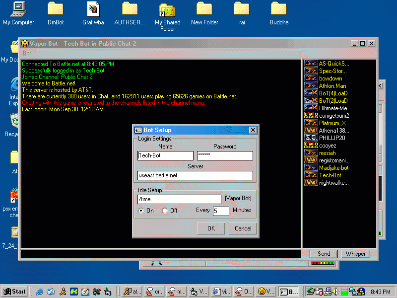



## A Battle\.net Bot, Vapor Bot \(UPDATE\)

### Description

This is an update to my "A Much Better Battle.net Bot" submission. I took out the crappy commands, because they are kinda pointless on a chat bot and i cleaned it up a lot. I made a setup form, and made better anti idle support. I also added War3 Icon support.
 
### More Info
 

             |
---                |---
**Submitted On**   |2002-09-29 20:44:10
**By**             |[Adam Bleech](https://github.com/Planet-Source-Code/PSCIndex/blob/master/ByAuthor/adam-bleech.md)
**Level**          |Beginner
**User Rating**    |4.4 (35 globes from 8 users)
**Compatibility**  |VB 5\.0, VB 6\.0
**Category**       |[Internet/ HTML](https://github.com/Planet-Source-Code/PSCIndex/blob/master/ByCategory/internet-html__1-34.md)
**World**          |[Visual Basic](https://github.com/Planet-Source-Code/PSCIndex/blob/master/ByWorld/visual-basic.md)
**Archive File**   |[A\_Battle\_n1381959292002\.zip](https://github.com/Planet-Source-Code/adam-bleech-a-battle-net-bot-vapor-bot-update__1-39374/archive/master.zip)

